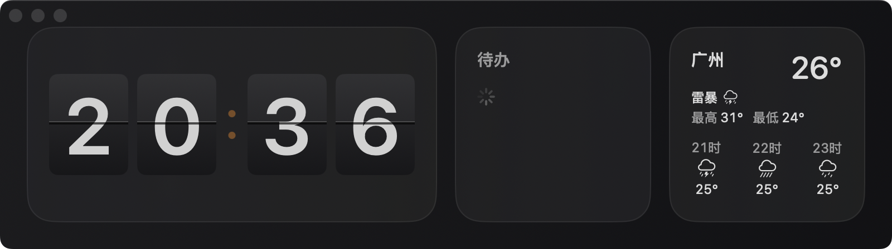

# Perch

**Your ambient dashboard for the second screen.**

> 让信息待在该待的地方。

Perch 是一款为第二块显示器设计的 macOS 常驻仪表盘：翻页时钟（或模拟时钟）、来自 macOS 提醒事项的待办、以及当地实时天气，一屏尽收。无标题栏的沉浸式窗口、低打扰的信息呈现，放在副屏上一眼可读。



## 功能

### ⏰ 时钟（两种风格，随时切换）
- **翻页时钟**：真实两翻板动画（旧数字翻落、新数字归位），近黑/浅灰渐变卡面、中缝细节、橙色呼吸灯
- **模拟时钟**：白盘黑字、橙色秒针平滑扫动、60 刻度
- 风格持久化，切换后布局自动重排

### ✅ 待办
- 数据源为 **macOS 提醒事项**（EventKit），无独立数据库
- 显示列表名、未完成数量与任务（单行截断、超出滚动）
- 完善的权限流程：未授权引导、被拒跳转系统设置、加载失败可重试
- 提醒事项变更自动刷新（防抖监听，不轮询）

### 🌤 天气
- 数据源为 **Open-Meteo**——免费、无需注册和 API key
- 当前温度、天气状况、今日最高/最低、逐小时预报（时间带"时"）
- 位置支持**自动定位**（CoreLocation + 反地理编码）或**手动城市**（正向地理编码）
- 30 分钟缓存、App 激活时刷新、失败保留上次数据并提示最后更新时间
- 所有网络请求带 15 秒超时，后端挂起不会冻结界面

### 🎨 外观
- 跟随系统 / 浅色 / 深色三态，独立于系统设置强制生效
- 翻页钟、模拟钟、天气卡全部适配双主题

### 🪟 窗口
- 无标题栏的沉浸式设计，红绿灯按钮悬浮左上
- 背景可拖拽移动窗口；最小宽度 800pt，适配副屏
- 所有 Widget 方形/2:1 比例，与 macOS 桌面小组件一致

## 系统要求

- macOS 14.0+
- Xcode 16+（构建）

## 构建与运行

```bash
# 生成 Xcode 项目（需要 xcodegen：brew install xcodegen）
xcodegen generate

# 命令行构建
xcodebuild -project Perch.xcodeproj -scheme Perch -configuration Debug \
  -destination 'platform=macOS' build

# 或直接双击 Perch.xcodeproj 用 Xcode 打开，⌘R 运行
```

构建产物位于 `build/DerivedData/Build/Products/Debug/Perch.app`。

### 权限说明

首次使用待办/天气功能时，请在系统弹窗中允许：

- **提醒事项**：待办卡显示你的未完成提醒
- **定位服务**（可选）：自动获取当地天气；拒绝后可在设置中手动输入城市

### 天气数据源

天气使用 [Open-Meteo](https://open-meteo.com/) 免费公开 API，无需注册与 key。天气请求直连（绕过系统代理）；若你的代理环境导致超时，可尝试切换代理规则。

## 项目结构

```
Perch/
├── App/                    # App 入口、设置窗口、窗口配置
├── Core/
│   ├── Models/             # Widget 协议、布局模式、外观等模型
│   ├── Services/           # ReminderService / WeatherService / LocationService
│   └── Storage/            # UserDefaults 键
├── Dashboard/              # 仪表盘视图与 4 栏响应式网格（Layout 协议）
├── DesignSystem/           # DashboardCard / 字体 / 间距 / 外观
└── Widgets/
    ├── Clock/              # AnalogClockView / FlipClockView / ClockStyle
    ├── Todo/               # TodoWidget / TodoViewModel
    └── Weather/            # WeatherWidget / WeatherViewModel
```

核心约定：

- **Widget 抽象**：所有卡片实现 `DashboardWidget` 协议（id / columnSpan / 尺寸元数据），仪表盘不硬编码任何 Widget，新增卡片无需改动网格
- **可压缩内容**：卡片内容置于 ScrollView，内容再多方形尺寸也不会被撑破
- **数据/展示分离**：Service → ViewModel → Widget，UI 不直接访问 EventKit / WeatherKit / 网络层

## 设置项（⌘,）

| 设置 | 说明 |
|------|------|
| 时钟风格 | 模拟 / 翻页时钟 |
| 提醒事项列表 | 待办卡显示的列表 |
| 天气位置 | 自动定位 / 手动城市 |
| 外观 | 跟随系统 / 浅色 / 深色 |

所有设置持久化于 UserDefaults。

## 路线图

V0.1 已完成时钟、待办、天气三大 Widget。未来可能的方向：

- AI 编码代理状态 Widget（Claude Code / Codex）
- 日历、GitHub、系统监控等更多 Widget
- Widget 自定义排列

## License

MIT
